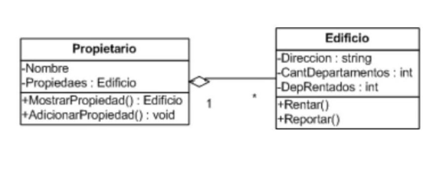

# AGREGACION
podemos tener diferentes relaciones entre las clases, una de ella es la de agregacion. en la cual una clase utiliza a otra para podel llevar acabo algo. En la agregacion pasa algo interesante y es que cada una de las clasa tiene vida independiente. cuando desaparace el objeto de la clase el objeto de la otra sigue existiendo.

## PROGRAMANDO LA AGREGACION.