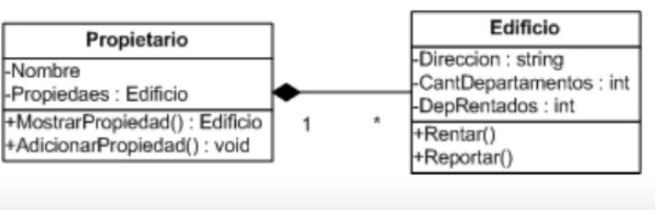

# COMPOSICION.
 CONSISTE CUANDO SE CREA UN OBJETO Y ESE OBJETO ESTA FORMADO POR OTROS OBJETOS, A DIFERENCIA DE LA AGREGACION, ESE OBJETO REQUIERE QUE EXISTA EN TERMINO DEL PRIMERO. ES DICER QUE SI DESAPARECE EL OBJETO TAMBIEN DESAPARECE LOS DEMAS OBJETOS QUE LO COMPONEN

UNA ESCUELA TIENE DIFERENTES SALONES, SI DESAPARECE LA ESCUELA TAMBIEN LOS SALONES.
LOS ALUMNOS TENDRIA AGREGACION INDEPENDIENMENETE SI EXISTE O NO LA ESCUELA
## COMO CREAR COMPOSICION EN C#

## PROBLEMAS CON EL ENCAPSULAMIENTO Y LA COMPOSICION